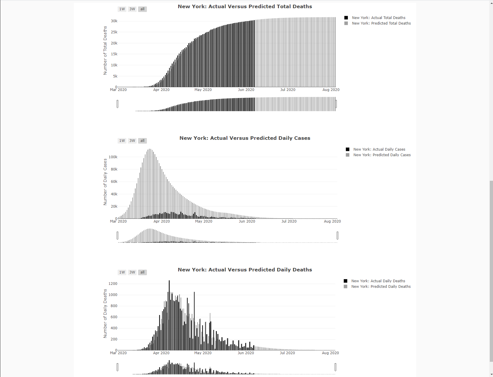

# PROJECT # 2
# Visualize me, Captain !!  
## Team Members
* *Swati Saxena*
* *Firdosh Patel*
* *Ann McNamara*
 
 
### This repository contains the files regarding a Website Visualization exercise conducted by our group. This folder contains the following:
1.	SQLite Database called "covidData.db".
2.	Python file called "covidData.py" that contains user-created functions. 
3.	Python file called "application.py" that cretaes api routes using the user-created functions.
4.	Folder called "static" that contains 2 folders:
    *	css - folder contains a file called "style.css" which is used to format the website.
    *	js - this folder contains a javascript file called "plots.js" which is used to create the visualizations ont eh website. 
5.	Folder called "templates" that contains a file called "index.html" which the file used to create the webpage. 
6.	File called "requirements.txt" which contains the requirements for the application to run. 
7.	A zip folder called "PROJECT_2_PREP_01.zip" which contains the above 6 files and folders, that was pushed to AWS. 
8.	A folder called "images" thatr contains images of our Website.
 
 
## Data Extraction:
This project is about a website visualtion exercise using COVID-19 data. 
 
 
As per wikipedia.org:
 
https://en.wikipedia.org/wiki/Coronavirus_disease_2019
 
Coronavirus disease 2019 (COVID-19) is an infectious disease caused by severe acute respiratory syndrome coronavirus 2 (SARS-CoV-2). It was first identified in December 2019 in Wuhan, China, and has resulted in a global pandemic. 
 
 
Our group undertook an exercise of analyzing COVID-19 data as it pertains to all the 50 states in the United States of America. 
 
We extracted data from the following sources for our analysis:
 
 
https://www.kaggle.com/imdevskp/corona-virus-report
 
This data source had data related to actual number of new daily cases, new daily deaths, and total cumulative deaths for every county and state in the United States. 
 
 
http://www.healthdata.org/covid/data-downloads
 
This data source had data related to the predicted number of new daily cases, new daily deaths, and total cumulative deaths for every state in the United States. 
 
 
https://worldpopulationreview.com/states/
 
This data source had data related to the population for every state in the United States. 
 
 
https://www.latlong.net/category/states-236-14.html
 
This data source had data related to the latitude and longitude for every state in the United States. 
 
 
https://www.50states.com/abbreviations.htm
 
This data source had data related to the state name abbreviations for every state in the United States. 
 
 
## Data Transformation:
We did the following to transform the data:
1.	Addressed NULL values. 
2.	Formatted the dates in a manner that would work with the flask library in python. 
3.	"Rolled-up" / summarized the dataset with actual numbers fromt he original level of State/County/Date to the level of State/Date.
4. Created a ranking for the states based on the Total Deaths Per Million of Population.
 
 
## Data Load: 
We then loaded the data into a SQLite database and called it covidData.db.
 
 
## Creation of a Python File with Functions:
We used SQL Alchemy to create functions in a python file called covidData.py. These functions allow us to extract the relevant data from the SQLite Database.
 
 
## Creation of a Python File with API routes:
We then used Flask to create API routes in a file called application.py. This file uses the functions created in the file called covidData.py. 
 
 
## Creation of an HTML file:
We then created an HTML file called index.html. This file contains the structure for the webpage. It also has all the relevant references / links to the underlying files that are used to format / style the webpage, as well as dynamically create the charts / graphs on the webpage.
 
 
## Creation of a Javascript file:
We then created a Javascript file called plots.js. This file contains all the logic that controls the dynamic interaction of a user with the webpage. This logic allows for dynamic updates to the charts / graphs based on the user's selection of a particular US state.
 
 
## Push to AWS:
We then zipped all the relevant files and folders and uploaded them to an environment on AWS using the service called "Elastic Beanstalk". This environment then provided us a URL for our webpage.
 
This is the URL for our webpage.
 
http://20200610v1-env.eba-3ip3pqzu.us-east-2.elasticbeanstalk.com/

## Attached below is a screenshot of the Top Half of our webpage. 

## Attached below is a screenshot of the Bottom Half of our webpage. 

# Conclusions:

